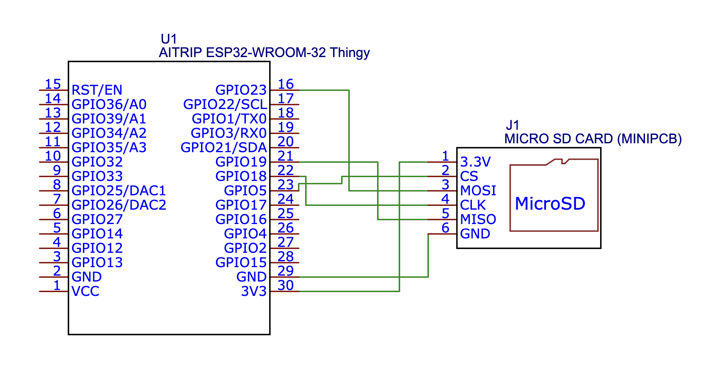
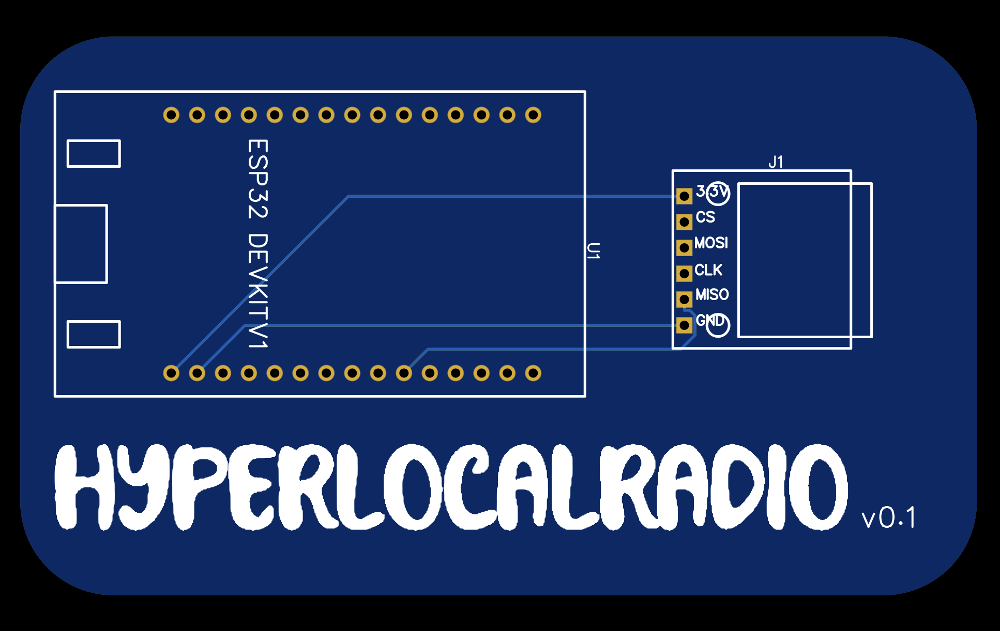

# hyperlocalradio
guerrilla radio, music player, protest tech, general purpose communication platform

This is a simple device which makes for a powerful platform when used appropriately. Using a ESP32 and a SD card reader, the hyperlocalradio is a multi-purpose-platform which can host a hotspot to host a music-playing radio station, a Wi-Fi hotspot to host content in the form a web pages, connect to Wi-Fi networks to host websites, or use web protocols such as TCP/UDP or ESP-NOW to create a communication network when used with other similar devices.

Need infrastructure to share content in a remote place? Host a webpage stored on the SD card on a local hotspot. 

Want to share your music or mixtape on the go? Connect the hyperlocalradio to a portable power bank, and throw it in your bag. When users connect to your network, they can find the content you've put on the SD card.

Have a need to subvert existing infrastructure? Pair the hyperlocalradio to a power source (power socket, solar panel), stash it somewhere it can't be found, and have it host a local Wi-Fi network to host and disseminate information. Alternatively, have the hyperlocalradio 

## Hardware

This project uses a commonly available ESP-WROOM-32 developer board (30-pin) module and a micro-SD card reader. The ESP-WROOM-32 dev board can be purchased for about $4-5 a piece, and the micro-SD card reader can be bought for less than a $1. 

The components can be wired together on a breadboard, but a proto-board would is preferred. The micro-SD card reader can be a little finicky with lose connections, hence soldered components on a breadboard is a much more reliable solution.

Here's how the components are connected:

A custom PCB is the best solution, which helps prevent the wiring mess of a proto-board, and packages the components efficiently.

PCB design files and Gerber files will be uploaded to the repository in case you'd like to use them to order your PCBs.

## Software

The mixtape uses C++ code, using the Arduino IDE to speak with the ESP32. Make sure you install the appropriate libraries to help Arduino IDE communicate with the ESP32, and have the right boards installed in the board manager.

This project uses the following libraries:
- [AsyncTCP](https://github.com/dvarrel/AsyncTCP)
- [ESPAsyncWebServer](https://github.com/mathieucarbou/ESPAsyncWebServer)
- Pre-installed WiFi, DNSServer, ESPmDNS, esp_cpu, SD, FS libraries

## Setup

hyperlocalradio can be setup in various configurations. Currently, it's setup to host webpages and music from the SD card. This is a good example which helps showcase the capabilities of this project. The current setup is a good starting point to be easily modified to suit various needs. 

The example titled 'hyperlocalradio_v1.0' in src/sofware requires the following folder setup in the SD card (FAT32):
SD
|-config.txt
|-web
	|-index.html
	|-portal.html
|-music

The ESP32 will create a open network with the SSID 'hyperlocalradio'. On joining, the user will be presented with a captive portal, the contents of which are driven by the 'portal.html' file. The intent of the captive portal is to help the user navigate to the url [hyperlocalradio.local](hyperlocalradio.local) to access the content on the main page, driven by 'index.html'. 

[hyperlocalradio.local](hyperlocalradio.local) or [192.168.4.1](192.168.4.1) is the local address, this can be changed in the code. 

The 'config.txt' file can be leveraged to quickly and easily change content on the web pages. In this example, any MP3 files in the 'music' folder will be populated in 'index.html'.

A sample SD card folder structure can be found at src/sdcard.

## Future Development

Different use cases will be built out, and examples will be uploaded to this repository. Other hardware variations will continue to be developed (solar panels, additional sensors, long range antennas, etc.). This project is licensed under Creative Commons Zero, any feedback, forks, and developments are welcome!